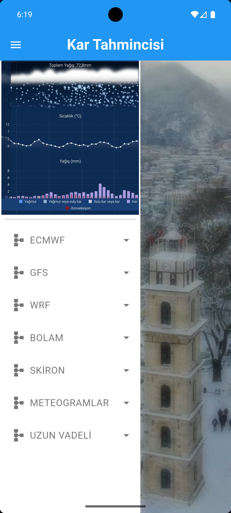
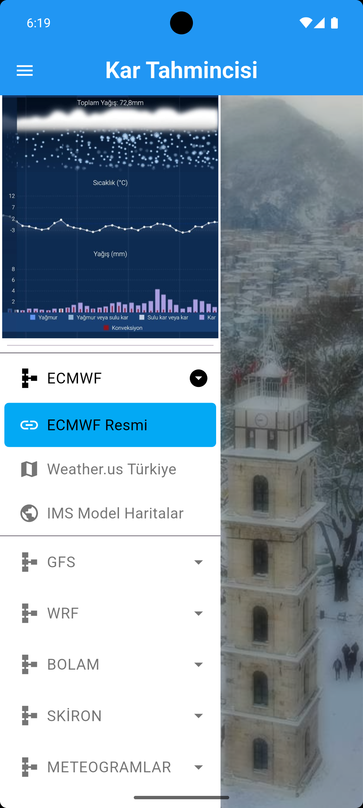
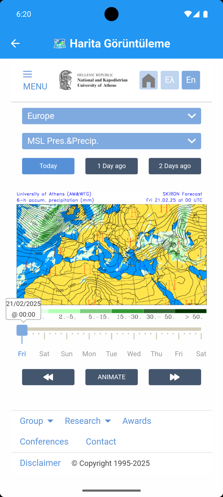
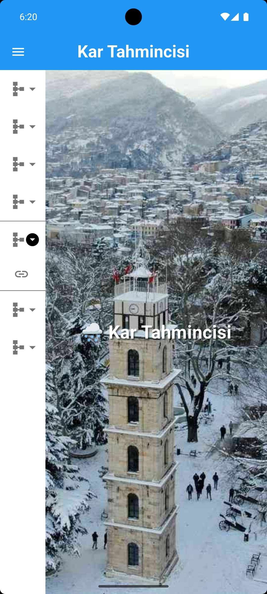

# 🌨️ Kar Tahmincisi - Flutter Uygulaması

📍 Türkiye ve tüm Dünyadaki hava tahminlerini, hava durumu modellerini ve ilgili meteorolojik verileri görüntülemenize olanak tanıyan bir Flutter uygulaması.

---

## 🚀 Özellikler
- 🔗 **Model Haritalarına Erişim:** ECMWF, GFS, WRF, BOLAM, SKİRON ve daha fazlası
- 🌐 **Web Görünümü:** JavaScript destekli tam ekran web haritaları
- 🗂️ **Kolay Navigasyon:** Modern **Side Menu** kullanımı
- ⚡ **Provider ile State Management**
- 🎨 **Responsive ve Dinamik UI**

---

## 📸 Uygulama Ekran Görüntüleri

### 🌨️ Splash Screen


### 📊 SideMenu Navigasyon


### 🌐 SideMenu Navigasyon Yönlendirme


### 🧭 Model Görünümü


### 📅 AnaSayfa


---

## 🛠️ Kullanılan Paketler

| Paket                   | Sürüm    | Açıklama                                |
|-------------------------|----------|------------------------------------------|
| `url_launcher`          | ^6.3.1   | URL'leri cihaz tarayıcısında açmak için  |
| `http`                  | ^1.3.0   | HTTP istekleri için                      |
| `easy_sidemenu`         | ^0.6.1   | Şık ve kolay kullanımlı yan menü sistemi  |
| `webview_flutter`       | ^4.10.0  | Uygulama içi web sayfası görüntüleme      |
| `flutter_launcher_icons`| ^0.14.3  | Uygulama ikonlarını yapılandırmak için    |
| `provider`              | ^6.1.2   | State management için                    |

---

## 💻 Kurulum ve Çalıştırma

```bash
git clone https://github.com/kullaniciadi/kar_tahmincisi.git
cd kar_tahmincisi
flutter pub get
flutter run
